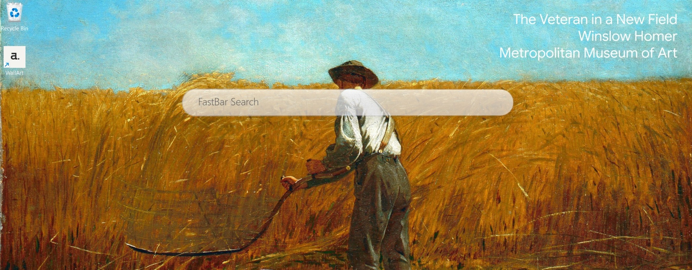
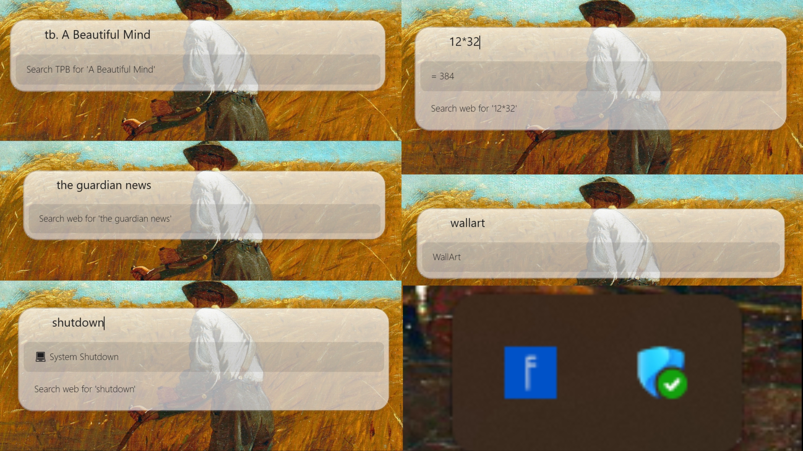

# FastBar

A fast, Spotlight style bar for Windows.

---

## What it does

Press **Alt + Space** anywhere to open FastBar. Start typing it finds apps, files, and does calculations instantly.

---

## Features

| What you type | What happens |
|---|---|
| `notepad` | Opens Notepad (or any app) |
| `25 * 4` | Shows the math result: `= 100` |
| `100 km to mi` | Converts units |
| `25 c to f` | Converts temperature |
| `weather Istanbul` | Shows current weather |
| `g. cats` | Searches **Google** for "cats" |
| `y. cats` | Searches **Yandex** for "cats" |
| `p. cats` | Searches **Pinterest** for "pins" |
| `sp. cats` | Searches **Startpage** for "cats" |
| `b. cats` | Searches **Bing** for "cats" |
| `bs. cats` | Searches **Brave Search** for "cats" |
| `tb. ubuntu` | Searches **The Pirate Bay** |
| `w. github` | Searches **winget ragerworks ** |
| `anything else` | Falls back to **DuckDuckGo** search |
| `shutdown` / `restart` / `sleep` / `lock` | System commands |

**File results:**
- Press **Enter** to open
- Hold **Ctrl + Enter** to reveal in folder
- Hold **Shift + Enter** to run as administrator

---

## Keyboard Shortcut

| Key | Action |
|---|---|
| `Alt + Space` | Show / hide FastBar |
| `↑ ↓` | Navigate results |
| `Enter` | Launch selected |
| `Esc` | Close |

---

## Themes

Right-click the tray icon to switch between **Dark** and **Light** themes.

---

## Requirements

- Windows 10 or later
- .NET 9 or later
